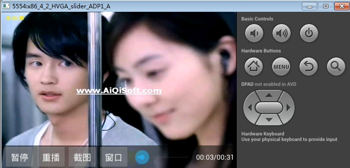

使用SurfaceView播放视频的截屏

#启动页SplashActivity
注意点:

1. 即使多次调用 startMainActivity() 也只执行跳转一次. 添加flag
2. 启动时立即退出,避免2s后又自动跳转. 所以退出时要清空handler中的所有消息

#软件结构分析

* VideoPager
* AudioPager
* NetVideoPager
* NetAudioPager

上面四个页面继承BasePager, 然后实例化四个页面并且放入集合, 当点击RadioGruop的时候，监听RadioGruop状态变化，显示不同页面，即在MainActivity切换界面时, 每次都是创建一个Fragment,并且复写onCreateView方法,同时把对应的BasePager中的rootView返回

(感觉这里可以优化: MainActivity中可以再创建一个集合,装载Fragment. 这样就不用每次都创建Fragment了)

#本地视频列表

1.写布局
 相对布局 ： ListView和TextView和ProgressBar，初始化

2.加载本地的视频，在子线程中加载视频，加载的视频放入集合中；
  设置适配器要在主线程；用Handler,设置适配器

3.设置item的点击事件，把视频播放出来

# 播放视频的几种方式:

    @Override
    public void onItemClick(AdapterView<?> parent, View view, int position, long id) {

        MediaItem mediaItem = mediaItems.get(position);

        /*
        //1.调起系统所有的播放-隐式意图
        Intent intent = new Intent();
        intent.setDataAndType(Uri.parse(mediaItem.getData()), "video/*");
        context.startActivity(intent);
        */

		/*
        //2.调用自己写的播放器-显示意图--一个播放地址
		// SystemVideoPlayer 中使用getIntent().getData();获取URI, 然后使用videoview.setVideoURI(uri);设置URI; 
		// 还可以使用 videoview.setMediaController(new MediaController(this)); 添加一个控制区域
        Intent intent = new Intent(context, SystemVideoPlayer.class);
        intent.setDataAndType(Uri.parse(mediaItem.getData()), "video/*");
        context.startActivity(intent);
		*/

        //3.传递列表数据-对象-序列化
        Intent intent = new Intent(context, SystemVideoPlayer.class);
        Bundle bundle = new Bundle();
        bundle.putSerializable("videolist", mediaItems);
        intent.putExtras(bundle);
        intent.putExtra("position", position);
        context.startActivity(intent);
    }

#MediaPlayer和VideoView
Android 系统中提供开发者开发多媒体应用（音视频方面）

一，MediaPlayer，解码的是底层，MediaPlayer负责和底层打交道，封装了很多方法
 start,pause,stop ,播放视频的类

这个MediaPlayer可以播放本地 和网络 的音视频.

 注意: 播放网络资源的时候，要联网权限

1,执行流程(MediaPlayer流程图)
2.视频支持的格式
 mp4,3gp,.m3u8(网络视频)
 直接用pc的.mp4文件, 不一定可以播放, 因为pc端的mp4文件可能码率比较高(high级别), 而移动设备支持的码率级别是base

二，VideoView
 显示视频，继承SurfaceView类，实现MediaController.MediaPlayerControl接口，封装了MediaPlayer, 而且VideoView中的 start,pause,stop等方法,本质上是调用MediaPlayer的

	public class VideoView extends SurfaceView
	        implements MediaPlayerControl, SubtitleController.Anchor {

 
SurfaceView特点:

1. 内嵌Surface, 且Surface采用纵深排序, 总是位于窗口后面
2. 兄弟视图会在视图层级的顶端显示, 可以添加overlay层
3. 若有透明控件, 每次Surface变化都会重新计算透明效果, 影响性能
4. 默认使用双缓存技术, 且在子线程中绘制, 不会阻塞主线程

 MediaPlayerControl接口,是MediaController的内部接口，是对媒体播放常用功能的抽象

	// 可以发现 MediaController 就是一个自定义View, 在makeControllerView方法中加载控制按钮布局,initControllerView()中添加事件. 而且该布局有竖屏和横屏两个布局
	public class MediaController extends FrameLayout {
	
		...
	    protected View makeControllerView() {
	        LayoutInflater inflate = (LayoutInflater) mContext.getSystemService(Context.LAYOUT_INFLATER_SERVICE);
	        mRoot = inflate.inflate(com.android.internal.R.layout.media_controller, null);
	
	        initControllerView(mRoot);
	
	        return mRoot;
	    }
	
		 public interface MediaPlayerControl {
		        void    start();
		        void    pause();
		        int     getDuration();
		        int     getCurrentPosition();
		        void    seekTo(int pos);
		        boolean isPlaying();
		        int     getBufferPercentage();
		        boolean canPause();
		        boolean canSeekBackward();
		        boolean canSeekForward();
		
		        /**
		         * Get the audio session id for the player used by this VideoView. This can be used to
		         * apply audio effects to the audio track of a video.
		         * @return The audio session, or 0 if there was an error.
		         */
		        int     getAudioSessionId();
		    }
	
	}

 videoview.setMediaController(new MediaController(context)); // 这里内部就是把videoView对象传入了到MediaController

	public class VideoView extends SurfaceView
	        implements MediaPlayerControl, SubtitleController.Anchor {
		...
	
	    public void setMediaController(MediaController controller) {
	        if (mMediaController != null) {
	            mMediaController.hide();
	        }
	        mMediaController = controller;
	        attachMediaController();
	    }
	
	    private void attachMediaController() {
	        if (mMediaPlayer != null && mMediaController != null) {
	            mMediaController.setMediaPlayer(this);  // 把videoView对象传入了到MediaController中, 且videoView还实现了MediaController.MediaPlayerControl接口
	            View anchorView = this.getParent() instanceof View ?
	                    (View)this.getParent() : this;
	            mMediaController.setAnchorView(anchorView); //以VideoView的父级标View为锚点, 对MediaController定位
	            mMediaController.setEnabled(isInPlaybackState());
	        }
	    }
		....
	}

#Activity的生命周期和横竖屏切换的生命周期

一，生命周期

1.创建Activity的时候执行的方法
onCreate-->onStart-->onResume

2.销毁Activity的时候执行的方法
onPause-->onStop->onDestroy

二，A页面跳转到B页面，点击返回，这个过程中的生命周期

B页面完全覆盖A页面的情况
A跳转B页面的生命周期方法执行顺序：
onPause(A)->onCreate(B)--->onStart(B)--->onResume(B)--->onStop(A)

B页面点击后返回生命周期执行顺序：
onPause(B)-->onRestart(A)-->onStart(A)-->onResume(A)->onStop(B)-->onDestroy(B)

B页面不完全覆盖A页面的请求
A跳转B页面的生命周期方法执行顺序
onPause(A)-->onCreate(B)-->onStart(B)-->onResume(B)
B页面点击后返回生命周期执行顺序
onPause(B)-->onResume(A)-->->onStop(B)-->onDestroy(B)

#Activity横竖屏切换的生命周期
默认情况：onPause-->onStop-->onDestroy-->onCreate-->onStart-->onResume

屏幕横竖屏切换导致生命周期重新执行

	<activity android:name=".activity.SystemVideoPlayer"
	    android:configChanges="keyboardHidden|screenSize|orientation"
	    />

# 根据布局自动生成代码实例的网站
	https://www.buzzingandroid.com/tools/android-layout-finder/

#系统播放界面功能

1. 控制面板的延迟隐藏     handler.sendEmptyMessageDelayed()
-- 单击屏幕, 若显示则变为隐藏且把消息移除, 若隐藏则变为显示; 且变为显示之后, 还要延迟发送一个隐藏面板的消息
-- 手指按下, 移除隐藏消息; 手指抬起, 在延迟发送一个隐藏面板的消息. --> 当面板显示时, 若一直触摸屏幕(滑动进度或声音), 则面板始终显示

2. 系统时间的实时获取与更新 (每秒更新一次)

3. 电量的更新  (动态注册广播BATTERY_CHANGED: int level = intent.getIntExtra("level", 0);//范围: 0~100;)

4. 暂停/播放功能. videoview.pause(); / videoview.start();

5. 播放进度的实时更新与调节功能以及网络视频时的缓冲效果  (每秒更新一次, videoview.seekTo(progress);)

6. 上/下个视频切换功能 videoview.setVideoPath(mediaItem.getData()); 设置上/下个视频的切换路径

7. 全屏与否(点击按钮和双击屏幕). 自定义 VideoView 控件, 拓展一个功能, 从而改变VideoView控件测量时的大小

8. 调节音量与静音: 滑块调节和触屏调节. 借助 AudioManager. 且还要监听物理按键改变声音
--  int voice = (int) Math.min(Math.max(mVol + delta, 0), maxVoice); // 把计算的值限制在[0, 15]之间, 用max和min分别限制下

9. 调节亮度

10. 监听网络视频播放卡顿,显示正在缓冲界面 (4.2新增API 和 自定义实现)

11. 每次播放视频开始时显示加载视频界面, 然后在OnPreparedListener中隐藏该界面

12. 播放出错的处理

# 播放界面的过滤器配置

    <intent-filter>
        <action android:name="android.intent.action.VIEW" />

        <category android:name="android.intent.category.DEFAULT" />
        <category android:name="android.intent.category.BROWSABLE" />

        <data android:scheme="rtsp" />
    </intent-filter>
    <intent-filter>
        <action android:name="android.intent.action.VIEW" />
        <category android:name="android.intent.category.DEFAULT" />

        <data android:mimeType="video/*" />
        <data android:mimeType="application/sdp" />
    </intent-filter>
    <intent-filter>
        <action android:name="android.intent.action.VIEW" />

        <category android:name="android.intent.category.DEFAULT" />
        <category android:name="android.intent.category.BROWSABLE" />

        <data android:scheme="http" />
        <data android:mimeType="video/mp4" />
        <data android:mimeType="video/3gp" />
        <data android:mimeType="video/3gpp" />
        <data android:mimeType="video/3gpp2" />
    </intent-filter>

    <intent-filter>
        <action android:name="android.intent.action.VIEW" />

        <category android:name="android.intent.category.LAUNCHER" />
        <category android:name="android.intent.category.DEFAULT" />
        <category android:name="android.intent.category.BROWSABLE" />

        <data
            android:mimeType="video/*"
            android:scheme="http" />
        <data
            android:mimeType="video/*"
            android:scheme="rtsp" />
        <data
            android:mimeType="video/*"
            android:scheme="rtmp" />
        <data
            android:mimeType="video/*"
            android:scheme="udp" />
        <data
            android:mimeType="video/*"
            android:scheme="tcp" />
        <data
            android:mimeType="video/*"
            android:scheme="file" />
        <data
            android:mimeType="video/*"
            android:scheme="content" />
        <data
            android:mimeType="video/*"
            android:scheme="mms" />
        <data android:mimeType="application/octet-stream" />
        <data android:mimeType="application/x-mpegurl" />
        <data android:mimeType="application/vnd.apple.mpegurl" />
    </intent-filter>
    <intent-filter>
        <action android:name="android.intent.action.VIEW" />

        <category android:name="android.intent.category.DEFAULT" />

        <data android:scheme="content" />
    </intent-filter>
    <intent-filter>
        <action android:name="android.intent.action.VIEW" />

        <category android:name="android.intent.category.DEFAULT" />
        <category android:name="android.intent.category.BROWSABLE" />

        <data
            android:mimeType="application/x-mpegurl"
            android:scheme="http" />
    </intent-filter>
    <intent-filter>
        <action android:name="android.intent.action.VIEW" />

        <category android:name="android.intent.category.DEFAULT" />
        <category android:name="android.intent.category.BROWSABLE" />

        <data android:scheme="rtsp" />
        <data android:scheme="rtmp" />
        <data android:scheme="mms" />
        <data android:scheme="tcp" />
        <data android:scheme="udp" />
    </intent-filter>
    <intent-filter>
        <action android:name="android.intent.action.VIEW" />
        <action android:name="android.intent.action.SEND" />
        <action android:name="android.intent.action.SENDTO" />

        <category android:name="android.intent.category.DEFAULT" />

        <data android:mimeType="video/*" />
        <data android:mimeType="application/sdp" />
        <data android:mimeType="application/octet-stream" />
    </intent-filter>
    <intent-filter>
        <action android:name="android.intent.action.VIEW" />

        <category android:name="android.intent.category.DEFAULT" />
        <category android:name="android.intent.category.BROWSABLE" />

        <data android:scheme="http" />
        <data android:mimeType="video/*" />
    </intent-filter>
    <intent-filter>
        <action android:name="android.intent.action.VIEW" />

        <category android:name="android.intent.category.DEFAULT" />
        <category android:name="android.intent.category.BROWSABLE" />

        <data android:scheme="file" />
        <data android:scheme="content" />
        <data android:scheme="http" />
        <data android:scheme="https" />
        <data android:scheme="ftp" />
        <data android:scheme="rtsp" />
        <data android:scheme="rtmp" />
        <data android:scheme="mms" />
        <data android:scheme="tcp" />
        <data android:scheme="udp" />
        <data android:scheme="gopher" />
        <data android:mimeType="video/*" />
        <!-- <data android:mimeType="audio/*" /> -->
    </intent-filter>
    <intent-filter>
        <action android:name="android.intent.action.VIEW" />

        <category android:name="android.intent.category.DEFAULT" />
        <category android:name="android.intent.category.BROWSABLE" />

        <data android:scheme="file" />
        <data android:scheme="content" />
        <data android:scheme="http" />
        <data android:scheme="https" />
        <data android:scheme="ftp" />
        <data android:scheme="rtsp" />
        <data android:scheme="rtmp" />
        <data android:scheme="mms" />
        <data android:scheme="tcp" />
        <data android:scheme="udp" />
        <data android:scheme="gopher" />
        <data android:host="*" />
        <data android:pathPattern=".*\\.avi" />
        <data android:pathPattern=".*\\.asf" />
        <data android:pathPattern=".*\\.f4v" />
        <data android:pathPattern=".*\\.flv" />
        <data android:pathPattern=".*\\.mkv" />
        <data android:pathPattern=".*\\.mpeg" />
        <data android:pathPattern=".*\\.mpg" />
        <data android:pathPattern=".*\\.mov" />
        <data android:pathPattern=".*\\.rm" />
        <data android:pathPattern=".*\\.vob" />
        <data android:pathPattern=".*\\.wmv" />
        <data android:pathPattern=".*\\.ts" />
        <data android:pathPattern=".*\\.tp" />
        <data android:pathPattern=".*\\.m3u" />
        <data android:pathPattern=".*\\.m3u8" />
        <data android:pathPattern=".*\\.m4v" />
        <data android:pathPattern=".*\\.mp4" />
    </intent-filter>

    <intent-filter>
        <action android:name="android.intent.action.VIEW" />

        <category android:name="android.intent.category.DEFAULT" />
        <category android:name="android.intent.category.BROWSABLE" />

        <data android:scheme="rtsp" />
        <data android:mimeType="video/*" />
    </intent-filter>
    <intent-filter>
        <action android:name="android.intent.action.VIEW" />
        <category android:name="android.intent.category.DEFAULT" />
        <category android:name="android.intent.category.BROWSABLE" />
        <data android:scheme="rtsp" />
    </intent-filter>
    <intent-filter>
        <action android:name="android.intent.action.VIEW" />
        <category android:name="android.intent.category.DEFAULT" />
        <category android:name="android.intent.category.BROWSABLE" />
        <data android:scheme="http" />
        <data android:mimeType="video/*" />
    </intent-filter>
    <intent-filter>
        <action android:name="android.intent.action.VIEW" />
        <category android:name="android.intent.category.DEFAULT" />
        <data android:mimeType="video/*" />
    </intent-filter>
    <intent-filter>
        <action android:name="android.intent.action.VIEW" />
        <category android:name="android.intent.category.DEFAULT" />
        <data android:scheme="file" />
        <data android:mimeType="video/*" />
    </intent-filter>
    <intent-filter>
        <action android:name="android.intent.action.SEARCH" />
        <category android:name="android.intent.category.DEFAULT" />
    </intent-filter>

#视频的SeekBar更新
1.视频的总时长和SeekBar的setMaxt(总时长);
 注意：准备好了的回调后

2.实例化Handler,每秒得到当前视频播放进度，SeekBar.setProgress(当前进度);

#SeekBar的拖拽

1.视频的总时长和SeekBar的setMaxt(总时长);
 注意：准备好了的回调后

2.设置SeekBar状态变化的监听

#注册广播有两种方式：动态注册和静态注册
静态注册：在功能清单文件注册，只要软件安装在手机上，就算软件不启动，也能收到对应的广播；
动态注册：只有注册的代码被执行后，才能收到对应的广播

有五个不能静态注册的广播:

　　android.intent.action.SCREEN_ON

　　android.intent.action.SCREEN_OFF

　　android.intent.action.BATTERY_CHANGED

　　android.intent.action.CONFIGURATION_CHANGED

　　android.intent.action.TIME_TICK

#Activity#onDestory()释放资源的顺序:

    @Override
    protected void onDestroy() {
        
        //移除所有的消息
        handler.removeCallbacksAndMessages(null);

        if (receiver != null) {
            unregisterReceiver(receiver);
            receiver = null;
        }
        LogUtil.e("onDestroy--");

        //释放资源的时候，先释放子类，在释放父类. 所以super写在下面
        super.onDestroy();
    }

	同理在onCreate()中初始化时, 先调用 super.onCreate()初始化父类中的信息

#手势识别器

 重写 双击，单击，长按

	detector = new GestureDetector(this, new MySimpleOnGestureListener());

    class MySimpleOnGestureListener extends GestureDetector.SimpleOnGestureListener {
        @Override
        public void onLongPress(MotionEvent e) { // 长按
            super.onLongPress(e);
            startAndPause();
        }

        @Override
        public boolean onDoubleTap(MotionEvent e) { // 双击 全屏显示与否
            setFullScreenAndDefault();
            return super.onDoubleTap(e);

        }

        @Override
        public boolean onSingleTapConfirmed(MotionEvent e) { // 单击
            if (isshowMediaController) {
                //隐藏
                hideMediaController();
                //把隐藏消息移除
                handler.removeMessages(MSG_HIDE_MEDIACONTROLLER);

            } else {
                //显示
                showMediaController();
                //发消息隐藏
                handler.sendEmptyMessageDelayed(MSG_HIDE_MEDIACONTROLLER, 4000);
            }

            return super.onSingleTapConfirmed(e);
        }
    }

    @Override
    public boolean onTouchEvent(MotionEvent event) { 
        //3.把事件传递给手势识别器
        /**
         * 1. 控制面板的隐藏与否:
         * -- 单击屏幕, 若显示则变为隐藏且把消息移除, 若隐藏则变为显示; 且变为显示之后, 还要延迟发送一个隐藏面板的消息
         * -- 手指按下, 移除隐藏消息; 手指抬起, 在延迟发送一个隐藏面板的消息. --> 当面板显示时, 若一直触摸屏幕(滑动进度或声音), 则面板始终显示
         */
        detector.onTouchEvent(event);  //onTouchEvent(),方法中把事件传递给手势识别器
	}

#调节声音
1.实例化AudioManger
 当前的音量
 最大音量

2.SeekBar.setMax(最大音量)
SeekBar.setProgress(当前的音量);

3.设置SeekBar状态变化

# 视频大小调节

原始的 VideoView 并没有设置视频大小的api, 这时得需要自己拓展一个该功能方法: 可以通过改变VideoView的大小来调整视频播放界面的大小.

	/**
	 * 自定义VideoView
	 * 可调整大小
	 */
	public class VideoView extends android.widget.VideoView {
	
	    /**
	     * 在代码中创建的时候一般用这个方法
	     * @param context
	     */
	    public VideoView(Context context) {
	        this(context,null);
	    }
	
	    /**
	     * 当这个类在布局文件的时候，系统通过该构造方法实例化该类
	     * @param context
	     * @param attrs
	     */
	    public VideoView(Context context, AttributeSet attrs) {
	        this(context, attrs,0);
	    }
	
	    /**
	     * 当需要设置样式的时候调用该方法
	     * @param context
	     * @param attrs
	     * @param defStyleAttr
	     */
	    public VideoView(Context context, AttributeSet attrs, int defStyleAttr) {
	        super(context, attrs, defStyleAttr);
	    }
	
	    @Override
	    protected void onMeasure(int widthMeasureSpec, int heightMeasureSpec) {
	        super.onMeasure(widthMeasureSpec, heightMeasureSpec);
	        setMeasuredDimension(widthMeasureSpec, heightMeasureSpec);
	    }
	
	    /**
	     * 设置视频的宽和高
	     * @param videoWidth 指定视频的宽
	     * @param videoHeight 指定视频的高
	     */
	    public void setVideoSize(int videoWidth,int videoHeight){
	        ViewGroup.LayoutParams params = getLayoutParams();
	        params.width = videoWidth;
	        params.height = videoHeight;
	        setLayoutParams(params);
	        // requestLayout(); //重新layout
	    }
	}

等比例缩放视频大小的一个算法:

    //屏幕的宽和高
    int width = screenWidth;
    int height = screenHeight;

    // VideoView#onMeasure()中, 有如下计算视频大小的算法, 即把原始视频的宽高放大至与屏幕宽高其中一边相等. 是等比例缩放.
    // for compatibility, we adjust size based on aspect ratio
    if (mVideoWidth * height < width * mVideoHeight) {
        //Log.i("@@@", "image too wide, correcting");
        width = height * mVideoWidth / mVideoHeight;
    } else if (mVideoWidth * height > width * mVideoHeight) {
        //Log.i("@@@", "image too tall, correcting");
        height = width * mVideoHeight / mVideoWidth;
    }

    videoview.setVideoSize(width, height);

# 系统音量的获取与设置

    // 使用AudioManager获取当前音量值及其范围
    am = (AudioManager) getSystemService(AUDIO_SERVICE);
    currentVoice = am.getStreamVolume(AudioManager.STREAM_MUSIC); // 获取当前音量值
    maxVoice = am.getStreamMaxVolume(AudioManager.STREAM_MUSIC);  // 获取音量最大值(0~15)

	// 第三个参数是一个flag, 若为FLAG_SHOW_UI即值为1, 则调整时显示音量条. 为0表示不显示音量条
	am.setStreamVolume(AudioManager.STREAM_MUSIC, progress, 0); // 设置音量为progress

    /**
     * 设置音量的大小
     * 调节音量是分两种情况的:
     * 1. 非静音的调节(静音撤销按钮 和 音量值在1~15直接调节)
     * 2. 静音的调节(静音按钮, 和 音量值调为0情况)
     *
     * @param progress
     */
    private void updataVoice(int progress, boolean isMute) {
        if (isMute) {
			// 第三个参数是一个flag, 若为FLAG_SHOW_UI即值为1, 则调整时显示音量条. 为0表示不显示音量条
            am.setStreamVolume(AudioManager.STREAM_MUSIC, 0, 0);
            seekbarVoice.setProgress(0);
        } else {
            am.setStreamVolume(AudioManager.STREAM_MUSIC, progress, 0);
            seekbarVoice.setProgress(progress);
            currentVoice = progress; // 记录非静音时的当前音量
        }
    }

	// 滑块监听器中
    @Override
    public void onProgressChanged(SeekBar seekBar, int progress, boolean fromUser) {
        if (fromUser) {
            if (progress > 0) {
                isMute = false;
            } else {
                isMute = true;
            }
            updataVoice(progress, isMute);
        }
    }

#在屏幕滑动改变声音

往下滑动
float distanceY = startY - endY  < 0;

往上滑动
float distanceY = startY - endY > 0;

 滑动屏幕的距离： 总距离 = 改变声音：音量最大值

 ==> 改变声音 = （滑动屏幕的距离： 总距离）*音量最大值

 ==> 最终声音 = 原来的 + 改变声音；

1.onTouchEvent方法里，在down的时候记录如下信息:
startY
touchRang 总距离
移除消息
mVol

2.在move时,记录如下信息
float endY =  envent.getY();
float distanceY = endY - startY;
改变声音 = （滑动屏幕的距离： 总距离）*音量最大值

最终声音 = 原来的 + 改变声音；

updataVoice();

3.在up的时候重新发消息

#如果让其他软件能调起自己写的播放器

参照系统源代码：

1.在功能清单文件添加下面的意图

        <intent-filter>
                <action android:name="android.intent.action.VIEW" />
                <category android:name="android.intent.category.DEFAULT" />
                <category android:name="android.intent.category.BROWSABLE" />
                <data android:scheme="rtsp" />
             </intent-filter>
             <intent-filter>
                <action android:name="android.intent.action.VIEW" />
                <category android:name="android.intent.category.DEFAULT" />
                <data android:mimeType="video/*" />
                <data android:mimeType="application/sdp" />
             </intent-filter>
             <intent-filter>
                <action android:name="android.intent.action.VIEW" />
                <category android:name="android.intent.category.DEFAULT" />
                <category android:name="android.intent.category.BROWSABLE" />
                <data android:scheme="http" />
                <data android:mimeType="video/mp4" />
                <data android:mimeType="video/3gp" />
                <data android:mimeType="video/3gpp" />
                <data android:mimeType="video/3gpp2" />
             </intent-filter>

2.文件或者图片浏览器

	//1.调起系统所有的播放器-隐式意图
	Intent intent = new Intent();
	intent.setDataAndType(Uri.parse("本地/网络视频播放地址"),"video/*");
	context.startActivity(intent);

3.视频播放器就会被调起并且播放

    uri = getIntent().getData();//文件夹，图片浏览器，QQ空间

4.设置播放地址

  videoview.setVideoURI(uri);

#手机连接电脑播放的tomcat的配置

1.在pc上设置wifi热点

2.手机连接到pc共享的wifi上

3.开启电脑的tomcat，并且把一个视频放让tomcat中

4.查看ip地址命令：ipconfig

5.要把视频的固定地址
 http://192.168.10.165:8080/yellow.mp4

修改成无线的ip地址，如下：
http://192.168.191.1:8080/yellow.mp4

#设置监听播放网络视频卡setOnInfoListener

前提：播放视频的时候，网络比较慢才会出现

1.Android2.3，在MediaPlayer引入的监听卡--自定义VideoView，把监听卡封装一下

2.Android4.2.2左右才把监听卡封装在VideoView中

	// Android 4.2 及以上版本 监听视频播放卡-可使用系统的api
    if (Build.VERSION.SDK_INT >= Build.VERSION_CODES.JELLY_BEAN_MR1) {
        videoview.setOnInfoListener(new MyOnInfoListener());
    }

	class MyOnInfoListener implements MediaPlayer.OnInfoListener{
	
        @Override
        public boolean onInfo(MediaPlayer mp, int what, int extra) {
            switch (what){
                case MediaPlayer.MEDIA_INFO_BUFFERING_START://视频卡了，拖动卡
                    ll_buffer.setVisibility(View.VISIBLE); //显示视频正在缓冲的视图
                    break;

                case MediaPlayer.MEDIA_INFO_BUFFERING_END://视频卡结束了，拖动卡结束了
                    ll_buffer.setVisibility(View.GONE);
                    break;
            }
            return true;
        }
    }

	// 自定义监听视频卡顿效果(每秒执行一下)
	// 原理:校验播放进度判断是否监听卡. 当前播放进度 - 上一次播放进度 理论值应该等于1s, 若过小的话, 说明卡顿
	// m3u8 直播的视频流. 本质上是把视频分成了一小段一小段的, 所以每次获取currentPosition都为0, 自定义的这种实现监听卡顿效果就不再适用了, 只能换成使用api17之后系统自带的监听器实现了

	int currentPosition = videoview.getCurrentPosition();//0

    if (videoview.isPlaying()) {
        int buffer = currentPosition - precurrentPosition;
        if (buffer < 500) {
            //视频卡了
            ll_buffer.setVisibility(View.VISIBLE);
        } else {
            //视频不卡了
            ll_buffer.setVisibility(View.GONE);
        }
    } else {
        ll_buffer.setVisibility(View.GONE);
    }

 	precurrentPosition = currentPosition;

	//能得到当前的播放进度的花，建议用校验播放进度判断是否监听卡这种方式, 如果不能得到当前播放进度，可以用系统的监听卡

# 播放出错的几种原因

	1.播放的视频格式不支持--跳转到万能播放器继续播放
	2.播放网络视频的时候，网络中断---1.如果网络确实断了，可以提示用于网络断了；2.网络断断续续的，则重新播放
	3.播放的时候本地文件中间有空白---下载做完成

#Vitamio案例的运行

1.下载地址：
https://www.vitamio.org/Download/

2.下载完成后解压，运行，参照案例集成

#Vitmiao的集成

1.关联Vitamio库

   compile project(':vitamio')

2.把功能清单文件对应的配置拷贝过去
 权限

    <uses-permission android:name="android.permission.WAKE_LOCK" />
    <uses-permission android:name="android.permission.INTERNET" />
    <uses-permission android:name="android.permission.ACCESS_NETWORK_STATE" />
    <uses-permission android:name="android.permission.READ_EXTERNAL_STORAGE" />
    <uses-permission android:name="android.permission.ACCESS_WIFI_STATE" />
    <uses-permission android:name="android.permission.READ_PHONE_STATE" />

  配置

    <!-- Don't forgot InitActivity -->
    <activity
        android:name="io.vov.vitamio.activity.InitActivity"
        android:configChanges="orientation|screenSize|smallestScreenSize|keyboard|keyboardHidden|navigation"
        android:launchMode="singleTop"
        android:theme="@android:style/Theme.NoTitleBar"
        android:windowSoftInputMode="stateAlwaysHidden" />

3.把系统SystemVideoPlayer复制一份，改名VitamioVideoPlayer
  导入的包全部换成是Vitamio的包，MediaPlayer,VideoView

自定义VitamioVideoView 继承Vitamio的VideoView

4.布局文件activity_system_video_player.xml复制一份改名activity_vitamio_video_player.xml,并且把里面的VideoView替换成Vitamio的VitamioVideoView

5.初始化Vitamio库，在布局文件加载之前

   Vitamio.isInitialized(this);

6.当系统播放器播放出错的时候跳转到VitamioVideoPlayer播放
 疑问：能否直接用Vitamio播放器播放呢？ 可以. 那为什么先用系统的播发器,播放出错的时候才使用万能播放器呢? 原因在于系统播放器的效率要比第三方的要高. 万能播放器虽然各种格式的视频都可以播放, 但是同样开销也很大

 注意：a,把数据传入VtaimoVideoPlayer播放器
       b,关闭系统播放器

# 解决 Vitamio 集成后在小米手机播放崩溃Bug, 在模拟器中却正常的现象
把项目中的gradle中的 targetSdkVersion 改成和样例中的一样即可
eg: targetSdkVersion 22

# 去掉两个Activity切换间的默认动画

    

    

	然后在清单文件中给Activity配置以上主题即可

让Activity在桌面显示图标，并且点击图标的时候进入软件

	<--一个APP可以有多个LAUNCHER, 这时安装程序的时候, 系统会优先启动清单列表中的第一个LAUNCHER界面. 而且桌面会形成多个图标. label属性还可以更改名字-->
	<category android:name="android.intent.category.LAUNCHER" />

# xutils框架

# XListView-Android
https://github.com/Maxwin-z/XListView-Android
(已停止更新)

		mListView = (XListView) findViewById(R.id.xListView);
		mListView.setPullLoadEnable(true);
		mAdapter = new ArrayAdapter<String>(this, R.layout.list_item, items);
		mListView.setAdapter(mAdapter);
		mListView.setXListViewListener(this);

	private void onLoad() {
		mListView.stopRefresh();
		mListView.stopLoadMore();
		mListView.setRefreshTime("刚刚");
	}
	
	@Override
	public void onRefresh() {
		mHandler.postDelayed(new Runnable() {
			@Override
			public void run() {
				items = geneItems();
				mAdapter = new ArrayAdapter<String>(XListViewActivity.this, R.layout.list_item, items);
				mListView.setAdapter(mAdapter);
				onLoad();
			}
		}, 2000);
	}

	@Override
	public void onLoadMore() {
		mHandler.postDelayed(new Runnable() {
			@Override
			public void run() {
				geneItems();
				mAdapter.notifyDataSetChanged();
				onLoad();
			}
		}, 2000);
	}

#两种直播

1.网络电视直接(eg: 新闻联播)

 相当于把电视的播放，转到手机上来播放

 从服务器获取流，一边下载一边播放；

http://cctv13.vtime.cntv.cloudcdn.net/live/no/23_/seg0/index.m3u8?uid=default&AUTH=Ite90HE2JJub81VrFFOU9WbgKr0t8yePUk9/dIg85CtViWynv8YvPcB2KIXUB8+2DookmfOpbagUKexGL0E/VA==

2.手机直播

 手机生成视频，一边上传到服务器，有服务器分发到不同的手机上。

	EasyPusher
	http://www.easydarwin.org/
	 
	 
	声网
	http://cn.agora.io/
	 
	微吼
	http://e.vhall.com/home/vhallapi/androidsdk
	 
	趣拍直播
	https://www.qupaicloud.com/
	 
	zego
	http://www.zego.im/
	 
	乐视云
	http://www.lecloud.com/product/mobile.html
	 
	七牛存储
	http://www.qiniu.com

#做视频播放器的两种做法

1.第一种方式：直接使用VideoView

2.第二种方式：在Activity中封装MediaPlayer和surfaceView

#Activity和服务交互的方式

广播，Intent,Handler,接口回调，Application,EventBus,AIDL

#AIDL小案例

1.开启服务
              Intent intent = new Intent(this,MyService.class);
				intent.setAction("com.yanguangfu.binder.action.AIDLService");
				bindService(intent, mConnection, Context.BIND_AUTO_CREATE);

   //			 startService(intent);

2. 得到服务的引用

  private AIDLService mService;
	private ServiceConnection mConnection = new ServiceConnection() {
		public void onServiceConnected(ComponentName className, IBinder service) {
			Log.e("yangguangfu", "MainActivity.onServiceConnected");
			mService = AIDLService.Stub.asInterface(service);
			try {
				mService.registerTestCall(mCallback);
			} catch (RemoteException e) {

			}
		}

		public void onServiceDisconnected(ComponentName className) {
			Log.e("yangguangfu", "MainActivity.onServiceDisconnected");
			mService = null;
		}
	};

3.配置服务
     <service android:name="com.yanguangfu.binder.MyService" >
            <intent-filter>
                <action android:name="com.yanguangfu.binder.action.AIDLService" />
            </intent-filter>
        </service>

4.aidl文件

	interface AIDLService {   
	    void registerTestCall(AIDLActivity cb);   
	    void invokCallBack();
	    
	    String getName();
	    int getAge();
	}  

5.服务类

 /**
 *
 * @author 杨光福
 *
 */
public class MyService extends Service {

	private AIDLActivity callback;

	@Override
	public void onCreate() {
		Log.e("yangguangfu", "MyService.onCreate");
	}

	@Override
	public void onStart(Intent intent, int startId) {
		Log.e("yangguangfu", "MyService.onStart startId="+startId);
	}

	@Override
	public IBinder onBind(Intent t) {
		Log.e("yangguangfu", "MyService.onBind");
		return mBinder;
	}

	@Override
	public void onDestroy() {
		Log.e("yangguangfu", "MyService.onDestroy");
		super.onDestroy();
	}

	@Override
	public boolean onUnbind(Intent intent) {
		Log.e("yangguangfu", "MyService.onUnbind");
		return super.onUnbind(intent);
	}

	public void onRebind(Intent intent) {
		Log.e("yangguangfu", "MyService.onRebind");
		super.onRebind(intent);
	}

	private String getNames(){
		Log.e("yangguangfu", "MyService.getName");
		return "name from service";
	}

	private int getAges(){
		Log.e("yangguangfu", "MyService.getAge");
		return 24;
	}

	private final AIDLService.Stub mBinder = new AIDLService.Stub() {

		@Override
		public void invokCallBack() throws RemoteException {
			Log.e("yangguangfu", "MyService.AIDLService.invokCallBack");
			Rect1 rect = new Rect1();
			rect.bottom=-1;
			rect.left=-1;
			rect.right=1;
			rect.top=1;
			callback.performAction(rect);
		}

		@Override
		public void registerTestCall(AIDLActivity cb) throws RemoteException {
			Log.e("yangguangfu", "MyService.AIDLService.registerTestCall");
			callback = cb;
		}

		@Override
		public String getName() throws RemoteException {
			Log.e("yangguangfu", "MyService.AIDLService.getName");
			return getNames();
		}

		@Override
		public int getAge() throws RemoteException {
			Log.e("yangguangfu", "MyService.AIDLService.getAge");
			return getAges();
		}
	};
}

#让歌曲可以在Service中播放

1.创建MusicPlayerService 继承Service

 把常用的方法先写出来，但不实现
	
	  /**
	 * 作者：尚硅谷-杨光福 on 2016/7/22 15:55
	 * 微信：yangguangfu520
	 * QQ号：541433511
	 * 作用：xxxx
	 */
	public class MusicPlayerService extends Service {
	
	    @Override
	    public void onCreate() {
	        super.onCreate();
	    }
	
	    @Nullable
	    @Override
	    public IBinder onBind(Intent intent) {
	        return null;
	    }
	
	    /**
	     * 根据位置打开对应的音频文件
	     * @param position
	     */
	    private void openAudio(int position){
	
	    }
	
	
	    /**
	     * 播放音乐
	     */
	    private void start(){
	
	    }
	
	    /**
	     * 播暂停音乐
	     */
	    private void pause(){
	
	    }
	
	    /**
	     * 停止
	     */
	    private void stop(){
	
	    }
	
	    /**
	     * 得到当前的播放进度
	     * @return
	     */
	    private int getCurrentPosition(){
	        return 0;
	    }
	
	
	    /**
	     * 得到当前音频的总时长
	     * @return
	     */
	    private int getDuration(){
	        return 0;
	    }
	
	    /**
	     * 得到艺术家
	     * @return
	     */
	    private String getArtist(){
	        return "";
	    }
	
	    /**
	     * 得到歌曲名字
	     * @return
	     */
	    private String getName(){
	        return "";
	    }
	
	
	    /**
	     * 得到歌曲播放的路径
	     * @return
	     */
	    private String getAudioPath(){
	        return "";
	    }
	
	    /**
	     * 播放下一个视频
	     */
	    private void next(){
	
	    }
	
	
	    /**
	     * 播放上一个视频
	     */
	    private void pre(){
	
	    }
	
	    /**
	     * 设置播放模式
	     * @param playmode
	     */
	    private void setPlayMode(int playmode){
	
	    }
	
	    /**
	     * 得到播放模式
	     * @return
	     */
	    private int getPlayMode(){
	        return 0;
	    }
	
	
	}

2.参数服务的方法，写对应的AIDL文件的方法

	   interface IMusicPlayerService {
	
	    /**
	        * 根据位置打开对应的音频文件
	        * @param position
	        */
	        void openAudio(int position);
	
	
	       /**
	        * 播放音乐
	        */
	        void start();
	
	       /**
	        * 播暂停音乐
	        */
	        void pause();
	
	       /**
	        * 停止
	        */
	        void stop();
	
	       /**
	        * 得到当前的播放进度
	        * @return
	        */
	        int getCurrentPosition();
	
	
	       /**
	        * 得到当前音频的总时长
	        * @return
	        */
	        int getDuration();
	
	       /**
	        * 得到艺术家
	        * @return
	        */
	        String getArtist();
	
	       /**
	        * 得到歌曲名字
	        * @return
	        */
	        String getName();
	
	
	       /**
	        * 得到歌曲播放的路径
	        * @return
	        */
	        String getAudioPath();
	
	       /**
	        * 播放下一个视频
	        */
	        void next();
	
	
	       /**
	        * 播放上一个视频
	        */
	        void pre();
	
	       /**
	        * 设置播放模式
	        * @param playmode
	        */
	        void setPlayMode(int playmode);
	
	       /**
	        * 得到播放模式
	        * @return
	        */
	        int getPlayMode();
	}

3.把服务在功底清单文件中注册

	   <service android:name=".service.MusicPlayerService">
	            <intent-filter>
	                <action android:name="com.atguigu.mobileplayer_OPENAUDIO" />
	            </intent-filter>
	        </service>
	    </application>

4.把AIDL 文件生成的类，在服务中绑定
	
	   @Nullable
	    @Override
	    public IBinder onBind(Intent intent) {
	        return stub;//一定要返回
	    }
	    private IMusicPlayerService.Stub stub = new IMusicPlayerService.Stub() {
	        MusicPlayerService service = MusicPlayerService.this;
	        @Override
	        public void openAudio(int position) throws RemoteException {
	            service.openAudio(position);
	        }
	
	        @Override
	        public void start() throws RemoteException {
	            service.start();
	
	        }
	
	        @Override
	        public void pause() throws RemoteException {
	            service.pause();
	        }
	
	        @Override
	        public void stop() throws RemoteException {
	            service.stop();
	        }
	
	        @Override
	        public int getCurrentPosition() throws RemoteException {
	            return service.getCurrentPosition();
	        }
	
	        @Override
	        public int getDuration() throws RemoteException {
	            return service.getDuration();
	        }
	
	        @Override
	        public String getArtist() throws RemoteException {
	            return service.getArtist();
	        }
	
	        @Override
	        public String getName() throws RemoteException {
	            return service.getName();
	        }
	
	        @Override
	        public String getAudioPath() throws RemoteException {
	            return service.getAudioPath();
	        }
	
	        @Override
	        public void next() throws RemoteException {
	            service.next();
	        }
	
	        @Override
	        public void pre() throws RemoteException {
	            service.pre();
	        }
	
	        @Override
	        public void setPlayMode(int playmode) throws RemoteException {
	            service.setPlayMode(playmode);
	        }
	
	        @Override
	        public int getPlayMode() throws RemoteException {
	            return service.getPlayMode();
	        }
	    };
	  
	
	    /**
	     * 根据位置打开对应的音频文件
	     * @param position
	     */
	    private void openAudio(int position){
	
	    }
	

5.绑定方式启动Service
    private void bindAndStartService() {
        Intent intent = new Intent(this, MusicPlayerService.class);
        intent.setAction("com.atguigu.mobileplayer_OPENAUDIO");
        bindService(intent, con, Context.BIND_AUTO_CREATE);
        startService(intent);//不至于实例化多个服务
    }

6.在MusicPlayerService得到音乐列表
    private void getDataFromLocal() {

        new Thread() {
            @Override
            public void run() {
                super.run();

                mediaItems = new ArrayList<>();
                ContentResolver resolver = getContentResolver();
                Uri uri = MediaStore.Audio.Media.EXTERNAL_CONTENT_URI;
                String[] objs = {
                        MediaStore.Audio.Media.DISPLAY_NAME,//视频文件在sdcard的名称
                        MediaStore.Audio.Media.DURATION,//视频总时长
                        MediaStore.Audio.Media.SIZE,//视频的文件大小
                        MediaStore.Audio.Media.DATA,//视频的绝对地址
                        MediaStore.Audio.Media.ARTIST,//歌曲的演唱者

                };
                Cursor cursor = resolver.query(uri, objs, null, null, null);
                if (cursor != null) {
                    while (cursor.moveToNext()) {

                        MediaItem mediaItem = new MediaItem();

                        mediaItems.add(mediaItem);//写在上面

                        String name = cursor.getString(0);//视频的名称
                        mediaItem.setName(name);

                        long duration = cursor.getLong(1);//视频的时长
                        mediaItem.setDuration(duration);

                        long size = cursor.getLong(2);//视频的文件大小
                        mediaItem.setSize(size);

                        String data = cursor.getString(3);//视频的播放地址
                        mediaItem.setData(data);

                        String artist = cursor.getString(4);//艺术家
                        mediaItem.setArtist(artist);

                    }

                    cursor.close();

                }

            }
        }.start();

    }

7.当绑定成功的时候播放音乐

    private IMusicPlayerService service;//服务的代理类，通过它可以调用服务的方法
    private ServiceConnection con = new ServiceConnection() {

        /**
         * 当连接成功的时候回调这个方法
         * @param name
         * @param iBinder
         */
        @Override
        public void onServiceConnected(ComponentName name, IBinder iBinder) {
            service = IMusicPlayerService.Stub.asInterface(iBinder);
            if(service != null){
                try {
                    service.openAudio(position);
                } catch (RemoteException e) {
                    e.printStackTrace();
                }
            }
        }

        /**
         * 当断开连接的时候回调这个方法
         * @param name
         */
        @Override
        public void onServiceDisconnected(ComponentName name) {
            try {
                if(service != null){
                    service.stop();
                    service = null;
                }

            } catch (RemoteException e) {
                e.printStackTrace();
            }
        }
    };

8.在服务总实现openAudio功能

     private void openAudio(int position) {
        this.position = position;
        if (mediaItems != null && mediaItems.size() > 0) {

            mediaItem = mediaItems.get(position);

            if (mediaPlayer != null) {
                mediaPlayer.release();
                mediaPlayer.reset();
            }

            try {
                mediaPlayer = new MediaPlayer();
                //设置监听：播放出错，播放完成，准备好
                mediaPlayer.setOnPreparedListener(new MyOnPreparedListener());
                mediaPlayer.setOnCompletionListener(new MyOnCompletionListener());
                mediaPlayer.setOnErrorListener(new MyOnErrorListener());
                mediaPlayer.setDataSource(mediaItem.getData());
                mediaPlayer.prepareAsync();

            } catch (IOException e) {
                e.printStackTrace();
            }

        } else {
            Toast.makeText(MusicPlayerService.this, "还没有数据", Toast.LENGTH_SHORT).show();
        }

     }

8.实现音乐的播放和暂停

      if(service != null){
                try {
                    if(service.isPlaying()){
                        //暂停
                        service.pause();
                        //按钮-播放
                        btnAudioStartPause.setBackgroundResource(R.drawable.btn_audio_start_selector);
                    }else{
                        //播放
                        service.start();
                        //按钮-暂停
                        btnAudioStartPause.setBackgroundResource(R.drawable.btn_audio_pause_selector);
                    }
                } catch (RemoteException e) {
                    e.printStackTrace();
                }
            }

# 通知栏

	manager = (NotificationManager) getSystemService(NOTIFICATION_SERVICE);
	Intent intent = new Intent(this, AudioPlayerActivity.class);
	intent.putExtra("notification", true);
	PendingIntent pi = PendingIntent.getActivity(this, 1, intent, 0);
	Notification notification = new Notification.Builder(this)
	        .setSmallIcon(R.drawable.notification_music_playing)
	        .setContentTitle("321音乐")
	        .setContentText("正在播放" + mediaItem.getName())
	        .setContentIntent(pi)
	        .build();
	notification.flags = Notification.FLAG_ONGOING_EVENT;//点击不消失
	manager.notify(1, notification);

# 上一首, 下一首

    /**
     * 播放下一个音频
     */
    private void next() {

        //1.根据当前的播放模式，设置下一个的位置
        setNextPosition();
        //2.根据当前的播放模式和下标位置去播放音频
        openNextAudio();
    }

#EventBus介绍

EventBus是一款针对Android优化的发布/订阅事件总线。主要功能是替代Intent,Handler,BroadCast在Fragment，Activity，Service，线程之间传递消息.优点是开销小，代码更优雅。以及将发送者和接收者解耦。

#源码下载地址

  https://github.com/greenrobot/EventBus

  最新版本3.0
  和之前不兼容

#EventBus的使用

1.注册
EventBus.getDefault().register(this);

2.自定义对应的类型类
  
   public class FirstEvent {

	private String mMsg;
	public FirstEvent(String msg) {
		mMsg = msg;
	}
	public String getMsg(){
		return mMsg;
	}
  }

4.订阅对应的方法

    public void onEventMainThread(FirstEvent event) {

		Log.d("harvic", "onEventMainThread:" + event.getMsg());
	}

	public void onEventMainThread(SecondEvent event) {

		Log.d("harvic", "onEventMainThread:" + event.getMsg());
	}

	public void onEventBackgroundThread(SecondEvent event){
		Log.d("harvic", "onEventBackground:" + event.getMsg());
	}

	public void onEventAsync(SecondEvent event){
		Log.d("harvic", "onEventAsync:" + event.getMsg());
	}

	public void onEvent(ThirdEvent event) {
		Log.d("harvic", "OnEvent:" + event.getMsg());
	}

5.订阅取消
 EventBus.getDefault().unregister(this);

6.发消息

    EventBus.getDefault().post(
						new FirstEvent("FirstEvent btn clicked"));

- onEvent:如果使用onEvent作为订阅函数，那么该事件在哪个线程发布出来的，onEvent就会在这个线程中运行，也就是说发布事件和接收事件线程在同一个线程。使用这个方法时，在onEvent方法中不能执行耗时操作，如果执行耗时操作容易导致事件分发延迟。

- onEventMainThread:如果使用onEventMainThread作为订阅函数，那么不论事件是在哪个线程中发布出来的，onEventMainThread都会在UI线程中执行，接收事件就会在UI线程中运行，这个在Android中是非常有用的，因为在Android中只能在UI线程中跟新UI，所以在onEvnetMainThread方法中是不能执行耗时操作的。
- onEventBackground:如果使用onEventBackgrond作为订阅函数，那么如果事件是在UI线程中发布出来的，那么-onEventBackground就会在子线程中运行，如果事件本来就是子线程中发布出来的，那么onEventBackground函数直接在该子线程中执行。
- onEventAsync：使用这个函数作为订阅函数，那么无论事件在哪个线程发布，都会创建新的子线程在执行onEventAsync.

EventBus3.0

1.方法名，不需要onEven开头
2.方法的线程模式ThreadMode 可以配置， 两个方法通用一个参数，可以设置优先级priority，值越大，优先收到

使用EventBus3.0

1.关联

2.注册
  //1.EventBus注册
      EventBus.getDefault().register(this);//this是当前类

3.订阅方法 ,不能私有
 //3.订阅方法
    @Subscribe(threadMode = ThreadMode.MAIN,sticky = false,priority = 0)
    public void showData(MediaItem mediaItem) {
        showViewData();
        checkPlaymode();
    }

4.取消注册

    //2.EventBus取消注册
        EventBus.getDefault().unregister(this);

5.发消息

##歌词同步步骤

#创建歌词显示控件ShowLyricView
  继承TextView

#创建歌词列表
 1.假设的歌词
 2.歌词列表
   private void initView() {
        lyrics = new ArrayList<>();

        Lyric lyric = new Lyric();
        for(int i=0 ; i<1000;i++){

            lyric.setTimePoint(1000 * i);
            lyric.setSleepTime(1500 + i);
            lyric.setContent(i + "aaaaaaaaaaaaaaa" + i);
            //把歌词添加到集合中
            lyrics.add(lyric);
            lyric = new Lyric();
        }
     }

#绘制歌词
 1.绘制前面部分
 2.绘制当前部分
 3.绘制后面部分

   @Override
    protected void onDraw(Canvas canvas) {
        super.onDraw(canvas);
        if(lyrics != null && lyrics.size() >0){
            //绘制歌词:绘制当前句
            String currentText = lyrics.get(index).getContent();
            canvas.drawText(currentText,width/2,height/2,paint);
            // 绘制前面部分
            int tempY = height/2;//Y轴的中间坐标
            for(int i= index-1;i >=0 ;i--){
                //每一句歌词
                String preContent = lyrics.get(i).getContent();
                tempY = tempY - textHeight;
                if(tempY < 0){
                    break;
                }
                canvas.drawText(preContent,width/2,tempY,whitepaint);
            }

            // 绘制后面部分
            tempY = height/2;//Y轴的中间坐标
            for(int i= index+1; i < lyrics.size() ;i++){
                //每一句歌词
                String nextContent = lyrics.get(i).getContent();
                tempY = tempY + textHeight;
                if(tempY > height){
                    break;
                }
                canvas.drawText(nextContent,width/2,tempY,whitepaint);
            }

        }else{
            //没有歌词
            canvas.drawText("没有歌词",width/2,height/2,paint);
        }
    }

#跟句当前播放歌曲进度实时绘制歌词的位置
 1.handler刷新
 2.跟句当前播放歌曲进度实时更新歌词绘制的位置

	   /**
	     * 根据当前播放的位置，找出该高亮显示哪句歌词
	     *
	     * @param currentPosition
	     */
	    public void setshowNextLyric(int currentPosition) {
	        this.currentPositon = currentPosition;
	        if (lyrics == null || lyrics.size() == 0)
	            return;
	
	
	        for (int i = 1; i < lyrics.size(); i++) {
	
	            if(currentPosition < lyrics.get(i).getTimePoint()){
	
	                int tempIndex = i - 1;
	
	                if(currentPosition >= lyrics.get(tempIndex).getTimePoint()){
	                    //当前正在播放的哪句歌词
	                    index = tempIndex;
	                    sleepTime = lyrics.get(index).getSleepTime();
	                    timePoint = lyrics.get(index).getTimePoint();
	                }
	
	            }
	        }
	        //重新绘制
	        invalidate();//在主线程中
	        //子线程
	//        postInvalidate();
	    }

#解析歌词
 1.解析每一句

    /**
     * 解析一句歌词
     * @param line [02:04.12][03:37.32][00:59.73]我在这里欢笑
     * @return
     */
    private String parsedLyric(String line) {
        ////indexOf第一次出现[的位置
        int pos1 = line.indexOf("[");//0,如果没有返回-1

        int pos2 = line.indexOf("]");//9,如果没有返回-1

        if(pos1 ==0 && pos2 != -1){//肯定是由一句歌词

            //装时间
            long[] times = new long[getCountTag(line)];

            String strTime =line.substring(pos1+1,pos2) ;//02:04.12
            times[0] = strTime2LongTime(strTime);

            String content = line;
            int i = 1;
            while (pos1 ==0 && pos2 != -1){
                content = content.substring(pos2 + 1); //[03:37.32][00:59.73]我在这里欢笑--->[00:59.73]我在这里欢笑-->我在这里欢笑
                pos1 = content.indexOf("[");//0/-1
                pos2 = content.indexOf("]");//9//-1

                if(pos2 != -1 ){
                    strTime = content.substring(pos1 + 1, pos2);//03:37.32-->00:59.73
                    times[i] = strTime2LongTime(strTime);

                    if(times[i] == -1){
                        return  "";
                    }

                    i++;
                }

            }

            Lyric lyric = new Lyric();
            //把时间数组和文本关联起来，并且加入到集合中
            for(int j = 0;j < times.length;j++){

                if(times[j] !=0){//有时间戳

                    lyric.setContent(content);
                    lyric.setTimePoint(times[j]);
                    //添加到集合中
                    lyrics.add(lyric);
                    lyric = new Lyric();

                }

            }

            return  content;//我在这里欢笑

        }

        return "";
    }

 2.加入到列表中

 3.排序
     //2.排序
            Collections.sort(lyrics, new Comparator<Lyric>() {
                @Override
                public int compare(Lyric lhs, Lyric rhs) {
                    if(lhs.getTimePoint() < rhs.getTimePoint()){
                        return  -1;
                    }else if(lhs.getTimePoint() > rhs.getTimePoint()){
                        return  1;
                    }else{
                        return 0;
                    }

                }
            });

 4.计算每句歌词的高亮时间

      //3.计算每句高亮显示的时间
            for(int i=0;i<lyrics.size();i++){
                Lyric oneLyric = lyrics.get(i);
                if(i+1 < lyrics.size()){
                    Lyric twoLyric = lyrics.get(i+1);
                    oneLyric.setSleepTime(twoLyric.getTimePoint()-oneLyric.getTimePoint());
                }
            }

 5.实现歌词同步

 6.根据不同的歌曲，加载不同的歌词文件
  private void showLyric() {
        //解析歌词
        LyricUtils lyricUtils = new LyricUtils();

        try {
            String path = service.getAudioPath();//得到歌曲的绝对路径

            //传歌词文件
            //mnt/sdcard/audio/beijingbeijing.mp3
            //mnt/sdcard/audio/beijingbeijing.lrc
            path = path.substring(0,path.lastIndexOf("."));
            File file = new File(path + ".lrc");
            if(!file.exists()){
                file = new File(path + ".txt");
            }
            lyricUtils.readLyricFile(file);//解析歌词

            showLyricView.setLyrics(lyricUtils.getLyrics());

        } catch (RemoteException e) {
            e.printStackTrace();
        }

        if(lyricUtils.isExistsLyric()){
            handler.sendEmptyMessage(SHOW_LYRIC);
        }

    }

#歌词缓缓的往上移动

	  //往上推移
	
	            float plush = 0;
	            if(sleepTime ==0){
	                plush = 0;
	            }else{
	                //平移
	                //这一句所花的时间 ：休眠时间 = 移动的距离 ： 总距离（行高）
	                //移动的距离 =  (这一句所花的时间 ：休眠时间)* 总距离（行高）
	//                float delta = ((currentPositon-timePoint)/sleepTime )*textHeight;
	
	                //屏幕的的坐标 = 行高 + 移动的距离
	                plush = textHeight + ((currentPositon-timePoint)/sleepTime )*textHeight;
	            }
	            canvas.translate(0,-plush);

 注意：要把字段改成float类型

#科大讯飞的集成

1.注册开发者账号

http://www.xfyun.cn/

2.申请应用-appkey

3.下载sdk

4.参照文档或者案例集成

# 待优化

音视频同时播放

顺序播放最后一首完成时, 暂停播放按钮状态不对